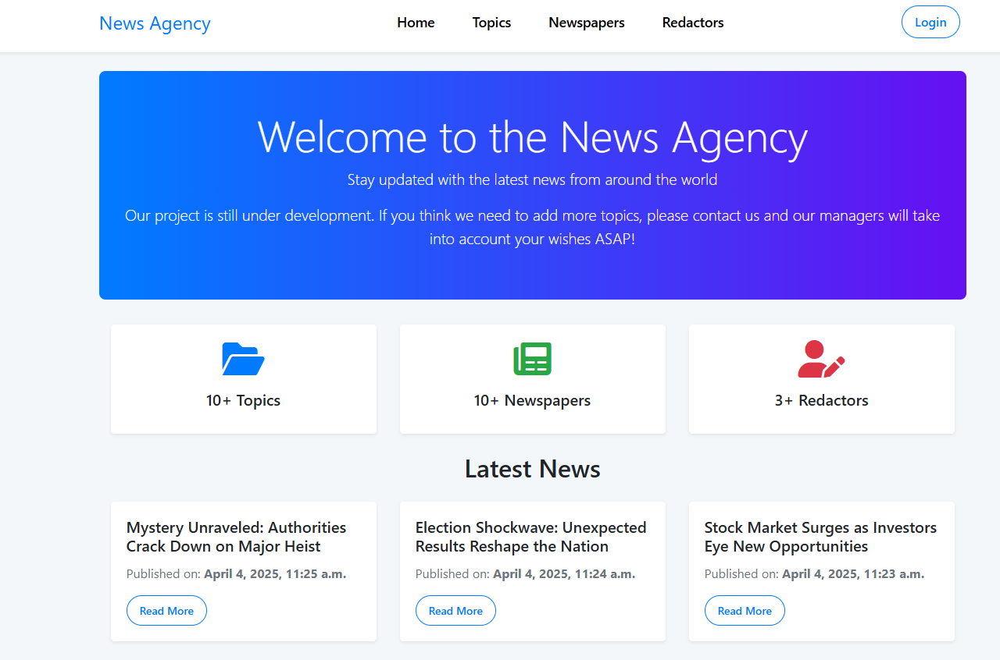

# 📰 News Agency – Django Project

A Django-based web application for managing a local news agency with topics, newspapers, and redactors.

## 🌐 Deployed Project

🔗 [Click here to check it!](https://news-agency-service.onrender.com/)

---

## ⚙️ Installation

> ✅ Python 3 must be installed beforehand.

```
# Clone the repository
git clone https://github.com/ip-ilya/news-agency-service.git

# Open project root folder
cd news-agency-service

# Set up a virtual environment
python -m venv venv

# Activate the virtual environment
# On Windows:
venv\Scripts\activate
# On macOS/Linux:
source venv/bin/activate

# Install dependencies
pip install -r requirements.txt
```

---

## 🔐 Environment Variables

1. Duplicate the `.env.sample` file and rename it to `.env`
2. Fill in your actual configuration values
3. Keep the `.env` file **private** – do **not** commit it to version control

---

## 🛠 Running the Project

```
# Apply migrations
python manage.py migrate

# Start the development server
python manage.py runserver
```

---

## ✨ Features

- 🧑‍💼 Authentication for Redactors (Users)
- 🗞 Manage Newspapers, Topics, and Redactors via website UI
- ⚙️ Admin panel for advanced management

---

## 🖼️ Demo Screenshot

Here’s how the interface looks:


---

## 👤 Test Credentials

You can use the following credentials to log in and explore the app:

### 🔑 Admin Redactor Account
- **Username:** admin_redactor
- **Password:** TNyKquF3fxF2

### 👥 Regular Redactor Account
- **Username:** redactor_1
- **Password:** TNyKquF3fxF2